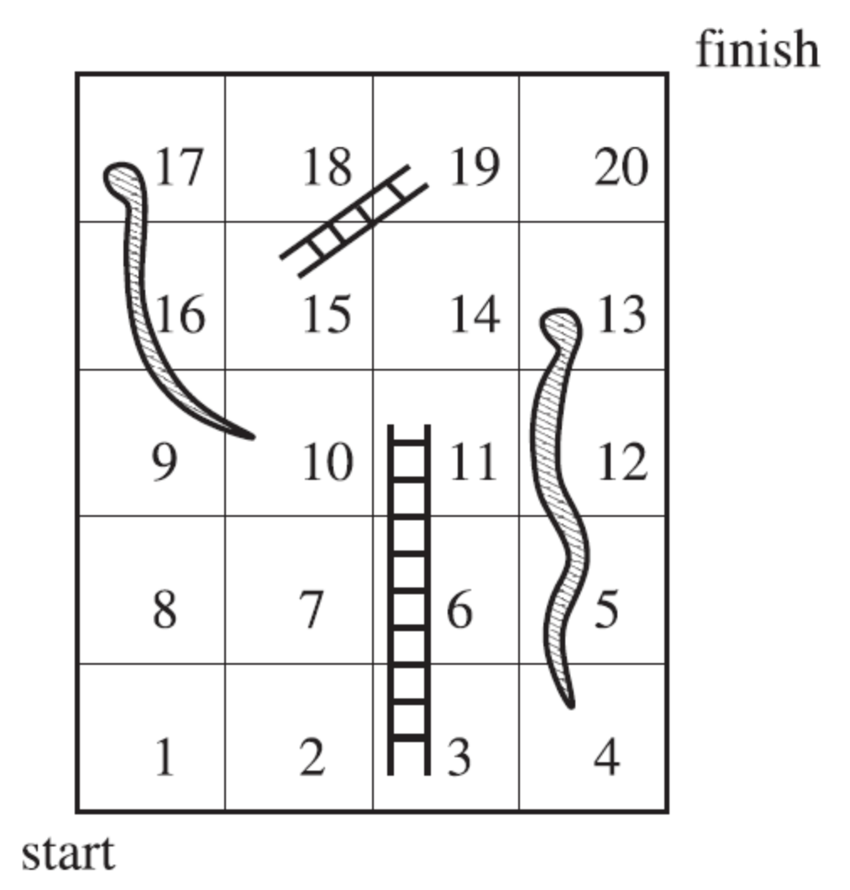

# Snakes and Ladders: Absorbing Markov Chain Analysis

This repository contains an analytical and numerical study of a 20-square **Snakes and Ladders** game using **Absorbing Markov Chains**. We compute the exact expected number of dice rolls required to reach the winning state starting from square 1 and validate the results via a **Monte Carlo simulation**.

---

## 1. Board Layout & Rules



The game is played on a 20-square grid with a standard 6-sided die. Rolling a number advances the player by that many positions. Landing on a snake head or ladder base immediately moves the player to the destination square:

* **Ladders (Ascents):**
  * $3 \to 11$
  * $15 \to 19$
* **Snakes (Descents):**
  * $13 \to 4$
  * $17 \to 10$

### Reduced State Space
Because landing on squares $\{3, 13, 15, 17\}$ immediately redirects the player to another position, these squares are non-occupiable at the end of a turn. Eliminating them yields a reduced state space $S$ of 16 valid states:

$$S = \{1, 2, 4, 5, 6, 7, 8, 9, 10, 11, 12, 14, 16, 18, 19, 20\}$$

* **Transient States:** 15 states ($\{1, \dots, 19\} \setminus \{3, 13, 15, 17\}$)
* **Absorbing State:** Square 20 (game complete)

---

## 2. Mathematical Methodology

An absorbing Markov chain with transient submatrix $Q$ and absorbing states can be partitioned in canonical form:

$$P = \begin{pmatrix} Q & R \\ 0 & I \end{pmatrix}$$

### Fundamental Matrix $N$
The **Fundamental Matrix** $N$ represents the expected number of times the process visits transient state $j$ given that it started in transient state $i$:

$$N = (I - Q)^{-1}$$

where:
* $Q \in \mathbb{R}^{15 \times 15}$ is the transition matrix between transient states.
* $I$ is the $15 \times 15$ identity matrix.

### Expected Time to Absorption
The total expected number of rolls to reach square 20 starting from square 1 (row index 0) is given by summing the entries of the first row of $N$:

$$\mathbb{E}[\text{Rolls}] = \sum_{j=1}^{15} N_{1, j}$$

---

## 3. Implementation Details

The analysis is implemented in a Jupyter Notebook using Python:

1. **Exact Symbolic Computing (`sympy`):** 
   * Transition probabilities are represented as exact rational numbers ($s = 1/6$).
   * Exact matrix inversion $(I - Q)^{-1}$ avoids floating-point roundoff errors.
2. **Monte Carlo Verification (`numpy`):**
   * Converts the symbolic transition matrix to a stochastic floating-point matrix.
   * Simulates 100,000 independent playthroughs starting from square 1.
   * Calculates the empirical mean and 95% confidence interval ($\pm 1.96 \cdot \text{SE}$).

---

## 4. Repository Structure

```text
.
├── board.png                    # Game board diagram
├── snakes_and_ladders.ipynb     # Jupyter Notebook with symbolic & Monte Carlo analysis
└── README.md                    # Project documentation
